<!-- Please do not change this html logo with link -->

<a target="_blank" href="https://www.microchip.com/" id="top-of-page">
   <picture>
      <source media="(prefers-color-scheme: light)" srcset="images/mchp_logo_light.png" width="350">
      <source media="(prefers-color-scheme: dark)" srcset="images/mchp_logo_dark.png" width="350">
      
   </picture>
</a>

# CLB Single Wire Interface Use Case for CLB Using the PIC18F56Q35 Microcontroller With VS Code®
 
This repository provides one Visual Studio Code project that uses the Configurable Logic Block (CLB) peripheral to encode/decode data for a single wire communication (SWI) with two client devices. SWI is a two-pin protocol (SI/O and Ground) that uses the energy from the SI/O pin to power the integrated circuit. The device’s software addressing protocol allows up to eight devices to share a common single‑wire bus. The CLB is used to perform hardware-based digital logic independent of the CPU, thus greatly offloading the CPU.

## Related Documentation

More details and code examples on the PIC18F56Q35 can be found at the following links:

- [PIC18F56Q35 Product Page](https://www.microchip.com/wwwproducts/en/PIC18F56Q35?utm_source=GitHub&utm_medium=TextLink&utm_campaign=PIC18F56Q35&utm_content=pic18f56q35-clb-auto-configuration-mplab-mcc-github&utm_bu=MCU08)
- [PIC18F56Q35 Code Examples on Discover](https://mplab-discover.microchip.com/v2?dsl=PIC18F56Q35)
- [PIC18F56Q35 Code Examples on GitHub](https://github.com/microchip-pic-avr-examples/?q=PIC18F56Q35)
- [CLB Peripheral Page](https://www.microchip.com/en-us/products/microcontrollers-and-microprocessors/8-bit-mcus/core-independent-and-analog-peripherals/system-flexibility/configurable-logic-block?utm_source=GitHub&utm_medium=TextLink&utm_campaign=MCU8_MMTCha_PIC18F56Q35&utm_content=pic18f56q35-clb-auto-configuration-mplab-mcc-github&utm_bu=MCU08)
- [Online, Stand-Alone CLB Configuration Tool](https://logic.microchip.com/clbsynthesizer/)
- [Microchip SWI Analyzer](https://ww1.microchip.com/downloads/aemDocuments/documents/MPD/ApplicationNotes/ApplicationNotes/AN5344-Analyzing-Single-Wire-Protocol-with-Saleae-Logic-Software-DS00005344.pdf)

## Software Used

- [MPLAB® Tools for VS Code®](https://www.microchip.com/en-us/tools-resources/develop/mplab-tools-vs-code?utm_source=GitHub&utm_medium=TextLink&utm_campaign=MCU8_PIC18-Q35&utm_content=pic18f56q35-clb-single-wire-interface-vscode-mcc-github&utm_bu=MCU08)
- [MPLAB® XC8 v3.10.0 or newer ](https://www.microchip.com/en-us/tools-resources/develop/mplab-xc-compilers?utm_source=GitHub&utm_medium=TextLink&utm_campaign=MCU8_PIC18-Q35&utm_content=pic18f56q35-clb-single-wire-interface-vscode-mcc-github&utm_bu=MCU08)
- [PIC18F-Q_DFP v1.30.487 or newer](https://packs.download.microchip.com/)

## Hardware Used

- The [PIC18F56Q35 Curiosity Nano Development board](https://www.microchip.com/en-us/development-tool/EV55P36A?utm_source=GitHub&utm_medium=TextLink&utm_campaign=MCU8_PIC18-Q35&utm_content=pic18f56q35-clb-single-wire-interface-mplab-mcc-github&utm_bu=MCU08) is used as a test platform:
<br>
<br>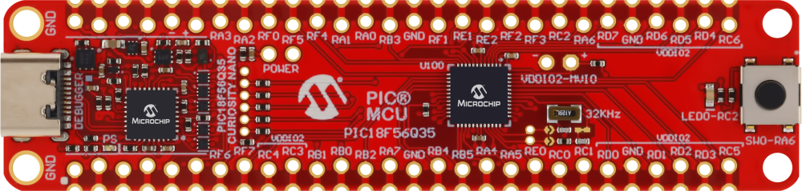

- The [Curiosity Nano Explorer board](https://www.microchip.com/en-us/development-tool/EV58G97A?utm_source=GitHub&utm_medium=TextLink&utm_campaign=MCU8_PIC18-Q35&utm_content=pic18f56q35-clb-single-wire-interface-mplab-mcc-github&utm_bu=MCU08) is used as a test platform:
<br>
<br>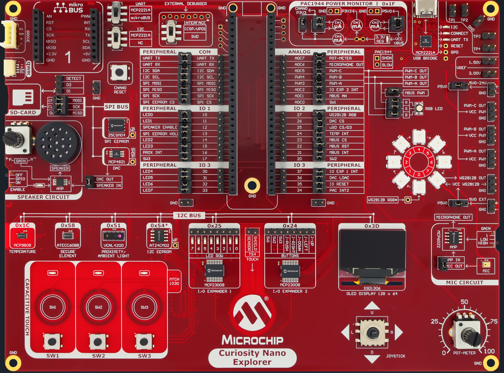
- USB type C cable
- AT21CS01 EEPROM memory
- DS18B20 temperature sensor

## Hardware Setup

This demo uses the PIC18F56Q35 Curiosity Nano Development board along with the Curiosity Nano Explorer board, a SWI EEPROM Click board and a DS18B20 temperature sensor.

The SWI Click board features the AT21CS01, a single-wire serial EEPROM with a unique factory-programmed 64-bit serial number. The Serial I/O pin of AT21CS01 is connected to the `PWM` pin of the mikroBUS™, that corresponds to the RF4 pin of the PIC18F56Q35 Curiosity Nano Board. A jumper wire is used to connect RF4 pin with RC3 pin, to use the control of pin direction and tristate via CLB peripheral (RF4 pin is not used in this application, it is mentioned only because of physical signal routing on Curiosity Nano Explorer board).

The DS18B20 temperature sensor is powered via RB1 pin, while I/O data pin is connected to the RC4 pin of the PIC16F56Q35 microcontroller.

<b>Important</b>: The the jumper for `PWM-A` and `MBUS-PWM` must be in place on the Curiosity Nano Explorer board to connect on-board mikroBus PWM pin to the RF4 pin of the PIc18F56Q35 Curiosity Nano board.

The whole setup is powered using a type C cable connected to a 5V power supply, such as a laptop.

An image with the full setup is shown below:
<br>  
<br>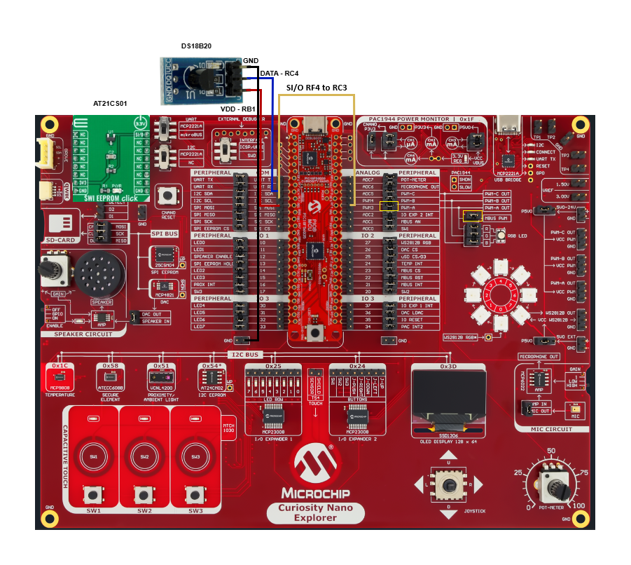

## Operation

To program the Curiosity Nano board with this VS Code project, follow the steps provided in the [How to Program the Curiosity Nano Board](#how-to-program-the-curiosity-nano-board) chapter.<br><br>

## Concept

The single-wire interface uses a host-client configuration, with communication done in time intervals reffered to as bit frame and lasts tBIT in duration. The host initiates the transmission by driving the SI/O line low for a short period. The length of time that the SI/O line is held low will dictate whether the transmitted bit is logic `0` or a logic `1`. In write operations, the host keeps the bus low according to the value of the transmitted bit, while for read operations it will drive the bus low for a short period (typically the same as for write logic `1`), then it will sample the bus to read the bit from the client.

Single Wire Write:
<br>
<br>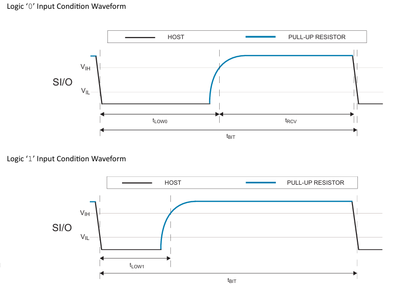

Single Wire Read:
<br>
<br>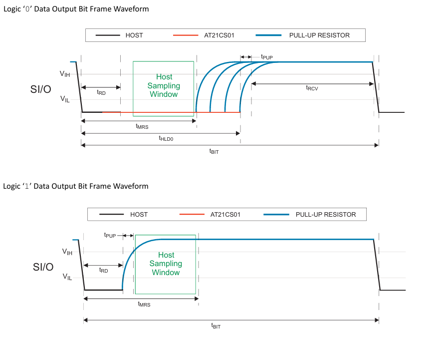

The PIC18F56Q35 acts as a host and uses the CLB peripheral to implement the hardware protocol encoder/decoder for single-wire interface. In this demo, two clients are used to exemplify the flexibility of the microcontrollers equiped with the CLB peripheral:

- DS18B20 temperature sensor - uses standars single-wire timings
- SWI EEPROM Click featuring AT21CS01 EEPROM - high-speed single-wire timings, with support for I2C interface emulation (ACK/NACK support)

Devices utilizes an 8-bit data structure. Data sent to the device over the single‑wire bus is interpreted by the state of the SI/O pin during specific time intervals or slots. All commands and data information are transferred with the Most Significant bit (MSb) first. Many SWI components reserve bits in the first byte for opcodes to perform specific actions within the Client devices.

Additionally to standard single-wire protocol, for AT21CS01 communication an additional acknowledge bit is needed after each byte. During bus communication, one data bit is transmitted in every bit frame and after eight bits (one byte) of data have been transferred, the receiving device must respond with either an Acknowledge (ACK) or a No Acknowledge (NACK) response bit during a ninth bit window. There are no unused clock cycles during any read or write operation, so there must not be any interruptions or breaks in the data stream during each data byte transfer and ACK or NACK clock cycle.

For more details about specific timings and software protocol implementation, refer to the DS18B20 and AT21CS01 data sheet.

## Implementation

The detailed CLB implementation is shown in the image below:
<br>
<br>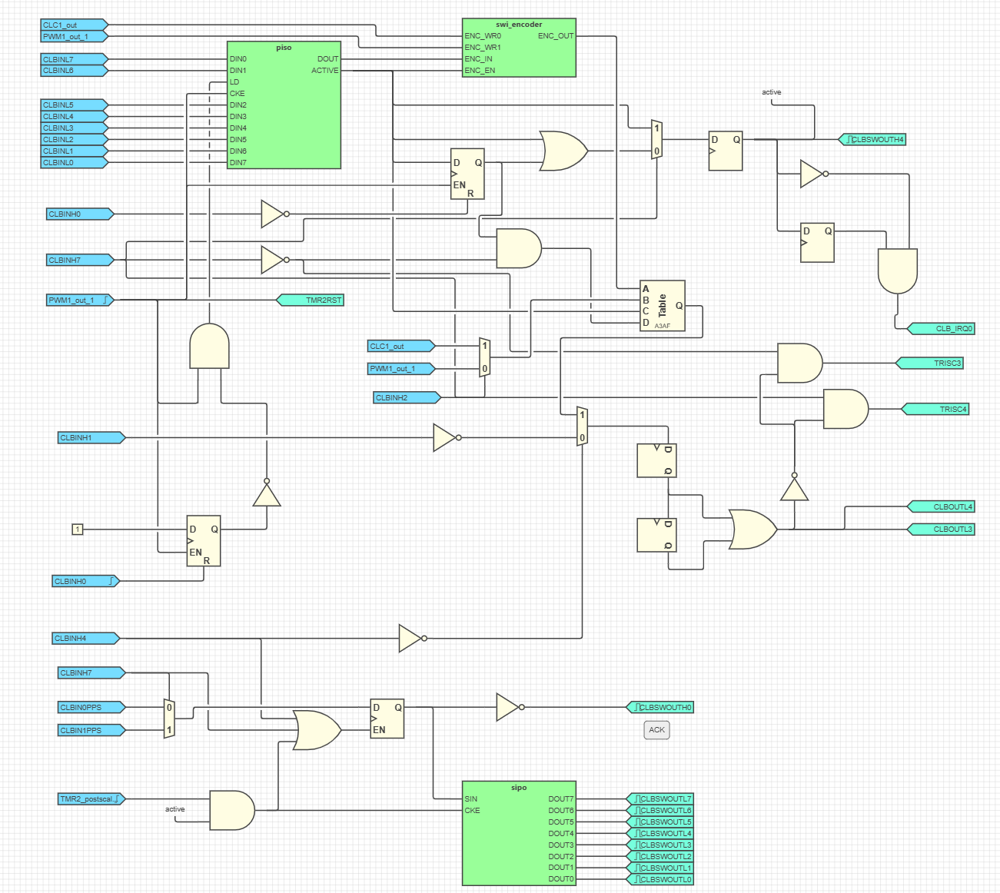

This design implements a single-wire hardware encoder/decoder, gated by the control logic. The main blocks of the circuit are:

- PISO — Parallel-In, Serial-Out shift register, this block latches eight parallel bits and shifts them out serially, one bit per clock
  - DIN[7:0] - data inputs from CLBINL[7:0]
  - LD - latch signal for data inputs
  - DOUT - serial bit stream 
  - ACTIVE - active flag, signaling valid bits on the DOUT stream, used as enable for SWI encoder
  - CKE - clock used to stream-out data
- SWI_ENCODER — Single-Wire Encoder, this block encodes the received serial data into the single-wire protocol
  - ENC_EN  - enable the encoder
  - ENC_IN  - serial data inputs
  - ENC_WR1 - used to creates logic `1` low pulses for single-wire data
  - ENC_WR0 - used to creates logic `0` low pulses for single-wire data
  - ENC_OUT - single-wire encoder data out
- SIPO — Serial-In, Parallel-Out shift register, this block is the receiver path that reconstructs incoming serial data back into an 8-bit parallel byte presented on the CLB software-readable outputs (CLBSWOUTL[7:0]).

Additional to the previous blocks, the following resources are used to implement control logic:

- PWM1 - Used to create the single-wire timings for logic `0` and `1` using output channels
  - PWM1_OUT1 is avalable directly as CLB input port (PWM1_out_1) and is used to create the logic `1` pulses. Also, the rising edge is used as synchronisation clock for the entire logic.
  - PWM1_OUT2 is routed through CLC1 (not avalable directly as CLB input port) and is used to create the logic `0` pulses.
- TMR2 - Used in Pulse mode, triggers the bit sampling in single-wire read operations. The pulse duration is software programmable to create specific timings for different working speeds.
- Control/data CLB interface:
  - CLBSWINH0 - encoder enable
  - CLBSWINH1 - software write to SWI pin (requires CLBSWIN4 = 1)
  - CLBSWINH2 - read/write select ( 0 - write operations, 1 - read operations)
  - CLBSWINH4 - enable bit-bang access to SWI pin (through CLB)
  - CLBSWINH7 - select the single-wire pin for single-wire communication (0 - select RC3 for AT21CS01 interfacing, 1 - select RC4 for DS18B20 interfacing). Used also to enable ACK/NACK support for AT21CS01 

  - CLB_IRQ0     - Single-Wire Read/Write Operation complete interrupt flag
  - CLBSWOUTH[0] - ACK/NACK status bit during AT21CS01 operations
  - CLBSWOUTH[4] - busy flag, Tx/Rx in progress

  - CLBSWINL[7:0] - encoder write data register
  - CLBSWOUTL[7:0] - encoder read data register  

TRISC3 and TRISC4 receive complementary enable conditions, like a demultiplexer behaviour. One serial data stream is steered to either CLBOUTL3 (pin RC3) or CLBOUTL4 (pin RC4), depending on the state of the select logic. The TRISC lines are enabling only one pin's output buffer at a time. CLB is dynamically flipping pin direction to use the same physical pin to transmit and receive data from the AT21CS01 and DS18B20.

## MCC Setup

The following peripherals and clock configurations are set up using the VS Code® Code Configurator (MCC) Melody for the PIC18F56Q35:

<br>

1. Clock Control:
<br>
<br>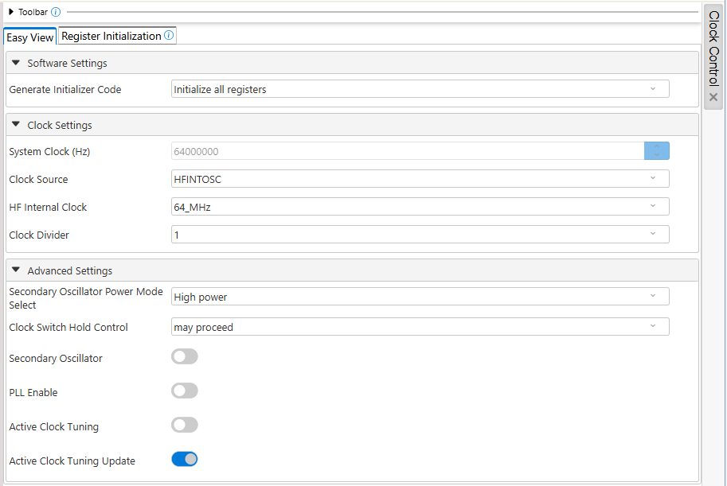
      - Clock Source: HFINTOSC
      - HF Internal Clock: 64_MHz
      - Clock Divider: 1

<br>

2. Configuration Bits:
<br>
<br>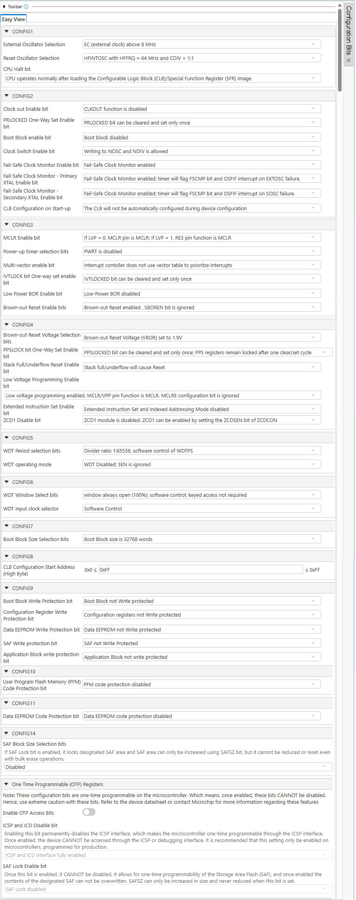

<br>

3. CLB Synthesizer Library:
<br>
<br>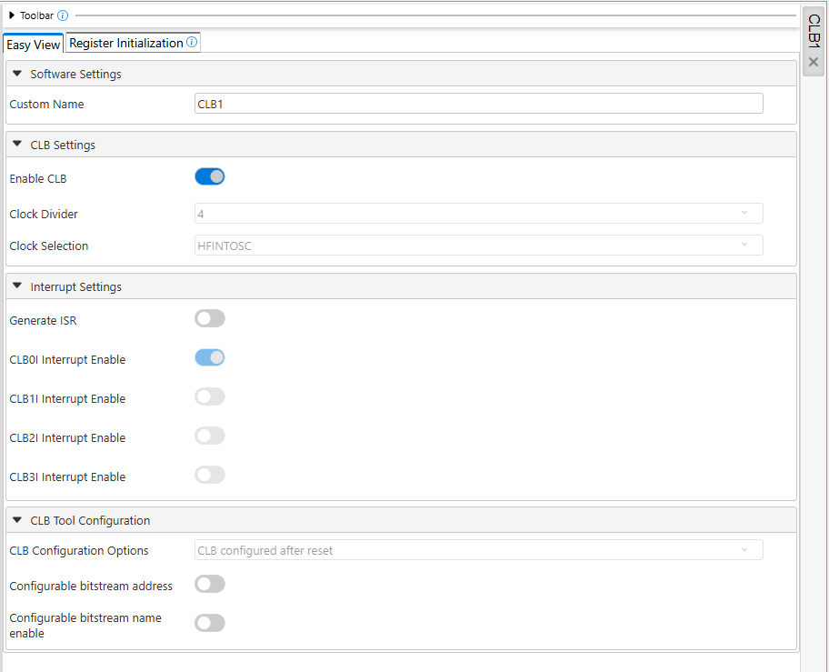
<br>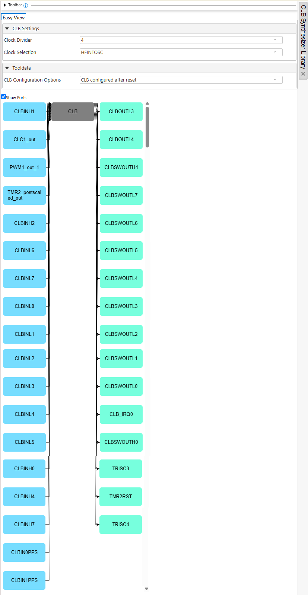
      - Enable CLB: Enabled
      - Clock Selection: HFINTOSC
      - Clock Divider: 4
      - CLB Configuration Options: CLB configured after reset (CLB configured by the firmware application)

<br>

4. CRC:
<br>
<br>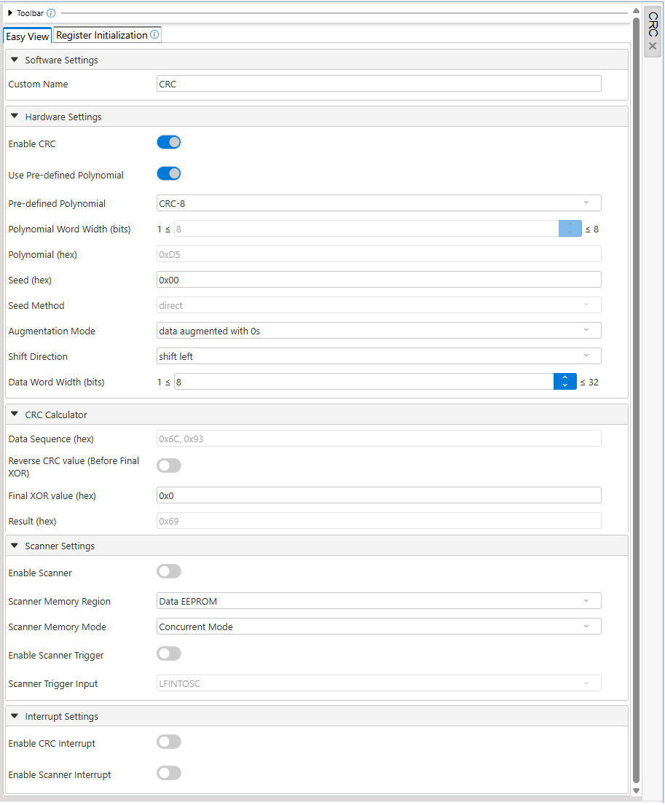  

<br>

5. Timer2:
<br>
<br>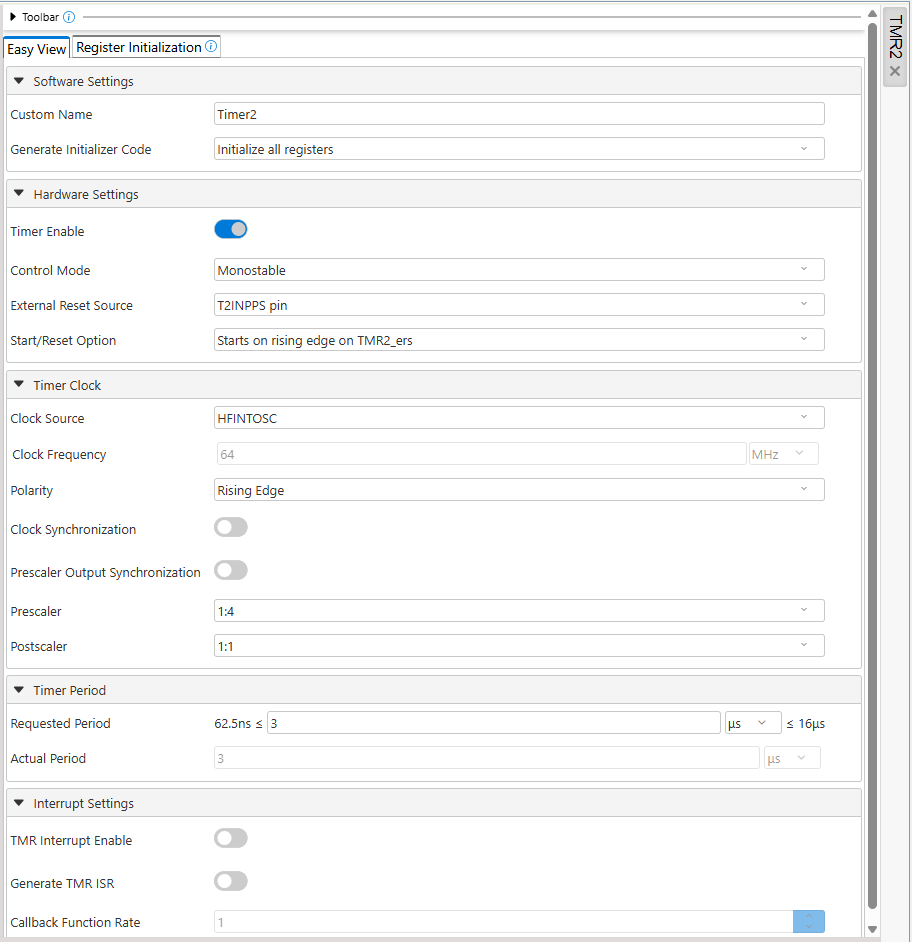
      - Timer Enable: Enabled
      - Control Mode: Monostable
      - External Reset Source: T2INPPS pin
      - Start/Reset Option: Starts on rising edge on TMR2_ers
      - Clock Source: HFINTOSC
      - Prescaler: 1:4
      - Postscaler 1:1
      - Requested Period: 3 us

<br>

6. PWM1:
<br>
<br>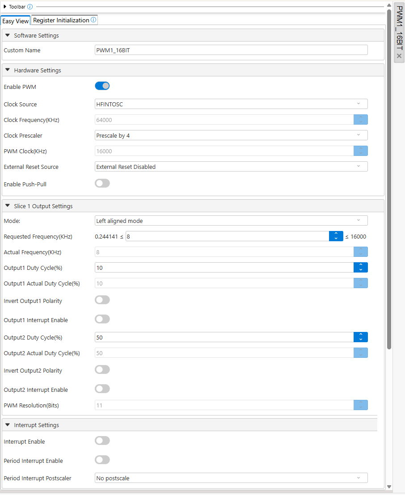
      - Enable PWM: Enabled
      - Clock Source: HFINTOSC
      - Clock Prescaler: Prescale by 4
      - Mode: Left aligned mode
      - Requested Frequency(kHz): 0.244141 (8 KHz)
      - Output1 Duty Cycle(%): 10
      - Output2 Duty Cycle(%): 50

<br>

7. CLC1:
<br>
<br>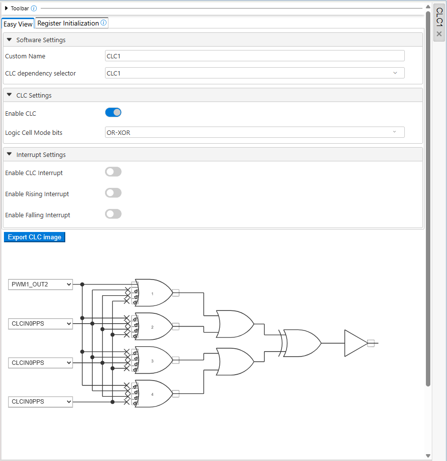
      - Enable CLC: Enabled
      - Logic Cell Mode bits: OR-XOR

<br>

8. UART2:
<br>
<br>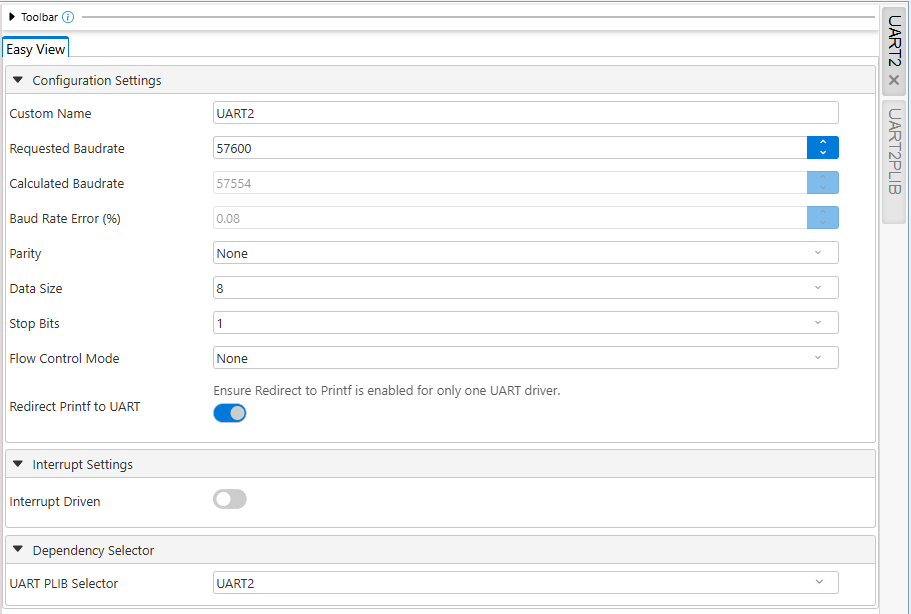
      - Requested Baudrate: 57600
      - Redirect STDIO to UART: Enabled
      - UART Dependency Selection: UART2

<br>

9. Pin Grid View:
<br>
<br>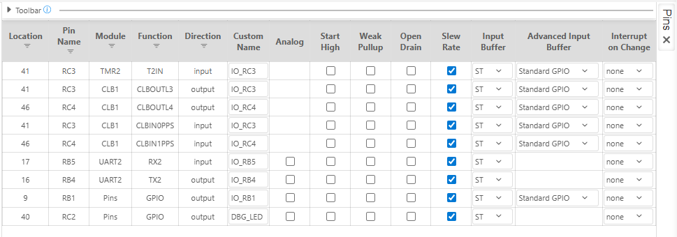
<br>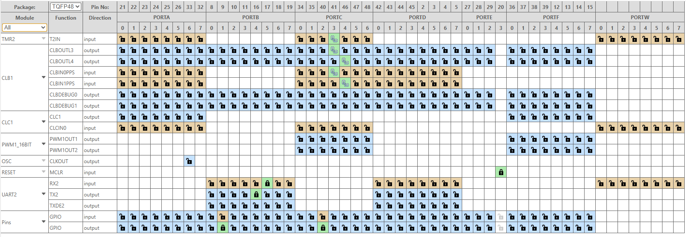
      - GPIO: RB1 (used to power the DS18B20 temperature sensor)
      - GPIO: RC2 (debug LED - Curiosity Nano Evaluation Kit)
      - CLBOUTL3: RC3 (transmission line used by AT21CS01 client - Curiosity Nano Evaluation Kit)
      - CLBOUTL4: RC4 (transmission line used by DS18B20 client - Curiosity Nano Evaluation Kit)
      - CLBIN0PPS: RC3 - AT21CS01 Single-wire input
      - CLBIN1PPS: RC4 - DS18B20 Single-wire input
      - UART2 TX: RB4 (TX2 - Curiosity Nano Evaluation Kit)
      - UART2 RX: RB5 (RX2 - Curiosity Nano Evaluation Kit)

## Demo

This project implements a single-wire hardware interface with support for two software protocols: standard single-wire (DS18B20) and I2C over single-wire (AT21CS01). The main application loop switches dynamically between two interfaces and implements basic software communication with single-wire devices to provide device specific data via the serial interface. The AT21CS01 device ID and serial number are displayed periodically into the terminal, while the device ID and measured temperature are displayed for the DS18B20 device.

Below is a capture of the AT21CS01 device ID information transmitted with the SWI protocol:
<br>
<br>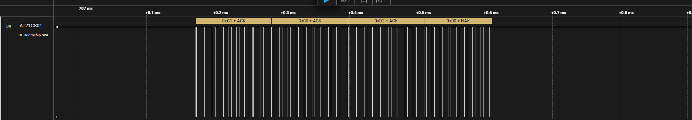

To be able to visualize the data transmitted with this protocol, a custom analyzer is needed. For more information, check [Microchip SWI Analyzer](#related-documentation) from the related documentation chapter.

## Summary

This project provides a SWI using the CLB that offloads a bit-banged serial protocol from the CPU into deterministic, glitch-free hardware, which is exactly what the CLB peripheral is designed for.

<br>

## How to Program the Curiosity Nano Board

This chapter demonstrates how to use the VS Code to program a PIC® device with an `Example_Project`. This is applicable to other projects.

1.  Connect the board to the PC.

2.  Open the `Example_Project` project in VS Code.

3.  Clean and build the `Example_Project` project.
    <br>Press `Ctrl` + `Shift` + `P` on the keyboard and select MPLAB CMake: Clean and Build.
    <br>
    <br>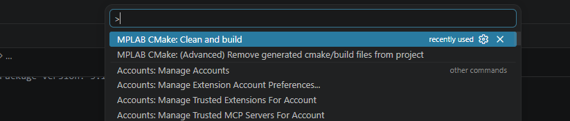

4. Select the desired configutation.
    <br>
    <br>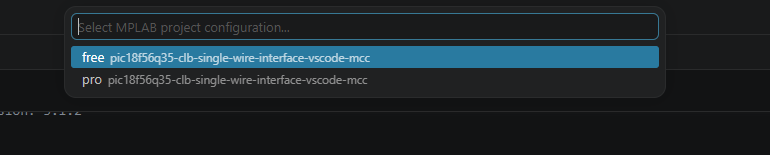

5. Program the project to the board.
    <br>Press `Ctrl` + `Shift` + `P` on the keyboard and select MPLAB: Program device.
    <br>
    <br>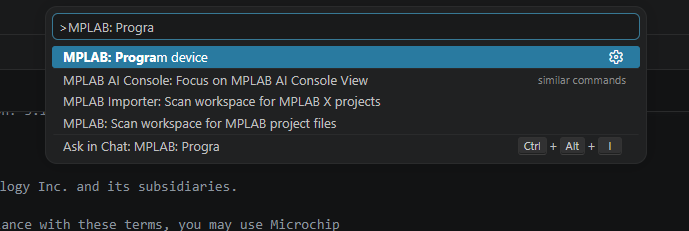

6. Select the desired configuration.
    <br>
    <br>

7.  Select PICxxxxx Curiosity Nano in the Connected Hardware Tool section of the project settings:
    <br>
    <br>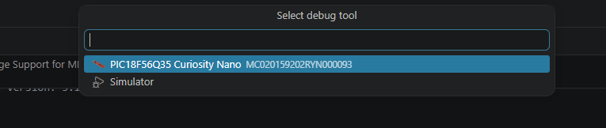
<br>

## Troubleshooting Guide

In case the project cannot be compiled due to ```VS Code``` or ```XC8``` not being able to support long paths, follow these steps:

1. In your VS Code PowerShell terminal, map your project folder to a temporary drive letter (e.g., X:): subst X: "C:\Users\Your Path to project".
<br>
<br>

2. Open that new space instantly in VS Code with the command line code X:.
<br>
<br>

3. Follow the steps provided in the [How to Program the Curiosity Nano Board](#how-to-program-the-curiosity-nano-board) chapter.

---

## Menu

- [CLB Single Wire Interface Use Case for CLB Using the PIC18F56Q35 Microcontroller With VS Code®](#clb-single-wire-interface-use-case-for-clb-using-the-pic18f56q35-microcontroller-with-vs-code)
  - [Related Documentation](#related-documentation)
  - [Software Used](#software-used)
  - [Hardware Used](#hardware-used)
  - [Hardware Setup](#hardware-setup)
  - [Operation](#operation)
  - [Concept](#concept)
  - [Implementation](#implementation)
  - [MCC Setup](#mcc-setup)
  - [Demo](#demo)
  - [Summary](#summary)
  - [How to Program the Curiosity Nano Board](#how-to-program-the-curiosity-nano-board)
  - [Troubleshooting Guide](#troubleshooting-guide)
  - [Menu](#menu)
